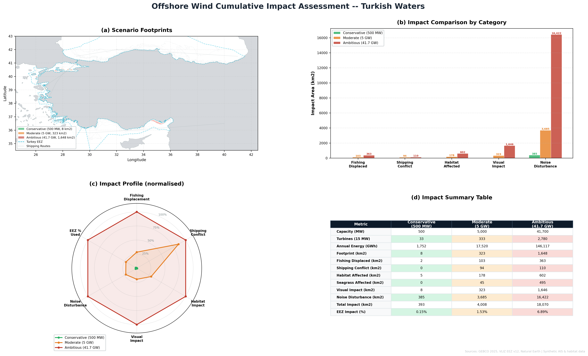

# Project 16 — Offshore Wind Cumulative Impact Assessment

Three-scenario cumulative impact assessment for offshore wind development 
in Turkish waters, comparing conservative, moderate, and ambitious 
deployment strategies.

## What This Project Demonstrates
- Multi-scenario environmental impact assessment
- Radar/spider chart for impact profile comparison
- Energy yield vs environmental trade-off analysis
- Strategic environmental assessment methodology
- Professional four-panel scientific figure design

## Tools Used
- Python (GeoPandas, Rasterio, Matplotlib, NumPy)

## Scenarios
| Scenario | Capacity | Turbines | Footprint |
|----------|----------|----------|-----------|
| Conservative | 500 MW | 33 | 8 km² |
| Moderate | 5 GW | 333 | 323 km² |
| Ambitious | 41.7 GW | 2,780 | 1,648 km² |

## Impact Comparison
| Metric | Conservative | Moderate | Ambitious |
|--------|-------------|----------|-----------|
| Annual Energy | 1,752 GWh | 17,520 GWh | 146,117 GWh |
| Fishing Displaced | 2 km² | 103 km² | 363 km² |
| Shipping Conflict | 0 km² | 94 km² | 110 km² |
| Habitat Affected | 5 km² | 178 km² | 602 km² |
| Seagrass Affected | 0 km² | 45 km² | 495 km² |
| Visual Impact | 8 km² | 323 km² | 1,646 km² |
| Noise Disturbance | 385 km² | 3,685 km² | 16,422 km² |
| Total Impact | 393 km² (0.15%) | 4,008 km² (1.53%) | 18,070 km² (6.89%) |

## Key Findings
- Conservative scenario has negligible impact — ideal starting point
- Ambitious scenario achieves better energy efficiency at scale 
  (8.1 GWh/km² vs 4.5 GWh/km² for conservative)
- Noise disturbance is the largest impact category across all scenarios
- Ambitious scenario affects 6.89% of EEZ — manageable with proper zoning
- Zero shipping conflict in conservative scenario — no route adjustments needed
- Seagrass impact jumps sharply from moderate to ambitious (45 → 495 km²)
- Moderate scenario offers best balance of energy output and impact footprint

## Output

