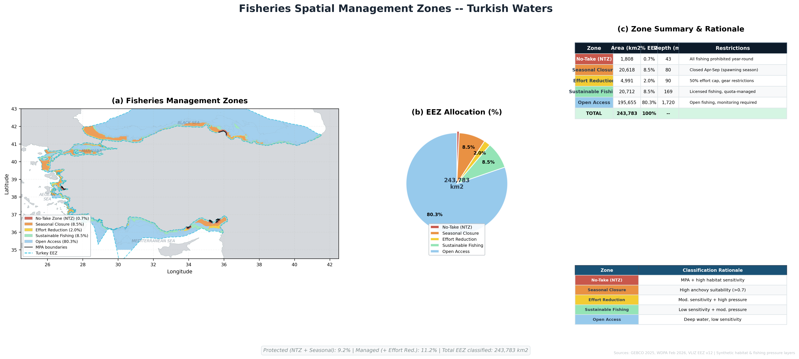

# Project 18 — Fisheries Spatial Management Zones

Evidence-based spatial fisheries management zone framework for Turkish 
waters combining habitat sensitivity, fishing pressure, and MPA data 
into five actionable management categories.

## What This Project Demonstrates
- Spatial fisheries management zone design
- Multi-criteria zone classification
- Ecosystem-based fisheries management approach
- Policy-ready zone framework with restrictions and rationale

## Tools Used
- Python (Rasterio, GeoPandas, Matplotlib, NumPy)

## Data Sources
- GEBCO 2025 Bathymetry
- WDPA Marine Protected Areas (Feb 2026)
- Marine Regions World EEZ v12
- Synthetic habitat sensitivity and fishing pressure layers

## Zone Framework
| Zone | Area (km²) | % EEZ | Mean Depth | Restrictions |
|------|------------|-------|------------|--------------|
| No-Take (NTZ) | 1,808 | 0.7% | 43m | All fishing prohibited year-round |
| Seasonal Closure | 20,618 | 8.5% | 80m | Closed Apr–Sep (spawning season) |
| Effort Reduction | 4,991 | 2.0% | 90m | 50% effort cap, gear restrictions |
| Sustainable Fishing | 20,712 | 8.5% | 169m | Licensed, quota-managed |
| Open Access | 195,655 | 80.3% | 1,720m | Open fishing, monitoring required |
| **TOTAL** | **243,783** | **100%** | | |

## Classification Rationale
| Zone | Criteria |
|------|----------|
| No-Take (NTZ) | MPA + high habitat sensitivity |
| Seasonal Closure | High anchovy suitability (>0.7) |
| Effort Reduction | Moderate sensitivity + high pressure |
| Sustainable Fishing | Low sensitivity + moderate pressure |
| Open Access | Deep water, low sensitivity |

## Key Findings
- Strict protection (NTZ): 0.7% of EEZ
- Protected + seasonal closures: 9.2% of EEZ
- Total actively managed: 11.2% of EEZ
- Open access covers deep offshore waters (mean depth 1,720m)
- Seasonal closures target April-September anchovy spawning season
- Framework provides realistic pathway toward CBD 30x30 target

## Output

