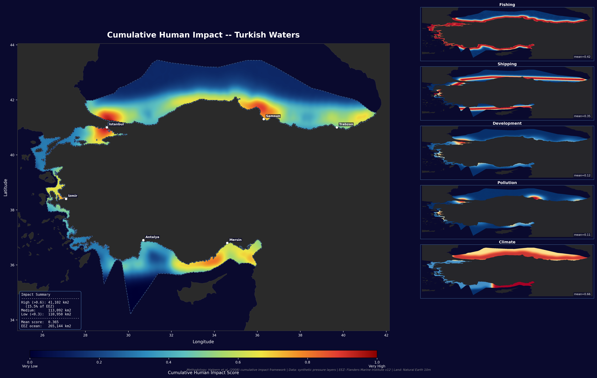

# Turkey Marine Spatial Planning Portfolio

A portfolio of 20 GIS and Python projects covering marine spatial planning 
for Turkish waters — Black Sea, Aegean, and Mediterranean. Built to 
demonstrate professional MSP, GIS, and spatial data science skills.

## 🗺️ Live Interactive Map
[View the interactive MSP map for Turkish waters](https://drahsanhussainkhan-cmd.github.io/turkey-msp-portfolio/project-13-interactive-webmap/turkey_msp_interactive.html)

## Skills Demonstrated
- Marine Spatial Planning (MSP) methodology
- GIS analysis (QGIS + Python/GeoPandas)
- Raster analysis (Rasterio, GEBCO bathymetry)
- Species distribution modelling
- Multi-criteria suitability analysis
- Cumulative impact assessment (Halpern et al. framework)
- Interactive web mapping (Folium)
- Automated PDF reporting (ReportLab)
- Interactive dashboards (Streamlit + Plotly)

## Tools & Languages
Python | QGIS | GeoPandas | Rasterio | Matplotlib | Folium | 
Streamlit | Plotly | ReportLab | SciPy | NumPy | Shapely

## Data Sources
- GEBCO 2025 Gridded Bathymetry
- WDPA Marine Protected Areas (Feb 2026)
- Marine Regions World EEZ v12
- Natural Earth 10m Physical Vectors
- OBIS Ocean Biodiversity Information System
- Synthetic AIS vessel tracking data

---

## Projects

| # | Project | Key Skills | Output |
|---|---------|------------|--------|
| 01 | MPA Boundary Mapping | QGIS, PyQGIS, WMS | Map |
| 02 | Bathymetry Visualization | QGIS, Raster styling | Map |
| 03 | Coastal Habitat Basemap | OBIS API, GeoPandas | Map |
| 04 | Fishing Vessel Density | KDE, Heatmap | Map |
| 05 | EEZ Overlap Analysis | Spatial join, Point-in-polygon | Map + Stats |
| 06 | Offshore Wind Screening | Multi-criteria, Rasterio | Map + Stats |
| 07 | Habitat Suitability Model | Fuzzy logic, SDM | Map |
| 08 | Coastal Erosion Risk | Risk index, Multi-factor | Map |
| 09 | MPA Gap Analysis | Gap analysis, CBD 30x30 | Map + Chart |
| 10 | Shipping Conflict Analysis | Buffer analysis, Conflict detection | Map |
| 11 | Cumulative Impact Mapping | Halpern framework, Multi-layer | Map |
| 12 | Tidal Energy Assessment | Power density, P=0.5ρv³ | Map |
| 13 | Interactive Web Map | Folium, 10 layers | HTML Map |
| 14 | Automated Reporting Pipeline | ReportLab, PDF generation | PDF + JSON |
| 15 | MPA Effectiveness Analysis | BACI design, t-test | Chart + Map |
| 16 | Wind Cumulative Impact | Scenario analysis, Radar chart | Map + Chart |
| 17 | Blue Carbon Mapping | Carbon accounting, Ecosystem valuation | Map |
| 18 | Fisheries Management Zones | Zone framework, Spatial classification | Map |
| 19 | Integrated MSP Scenario | Full spatial plan, Compatibility matrix | Map |
| 20 | Interactive Dashboard | Streamlit, Plotly, 7 pages | Dashboard |

---

## Key Findings

| Metric | Value |
|--------|-------|
| Turkey EEZ area | 243,783 km² |
| Current MPA coverage | 0.10% |
| CBD 30x30 gap | 72,757 km² |
| Offshore wind potential | 41.7 GW |
| Tidal energy potential | 750 MW |
| High cumulative impact | 15.5% of EEZ |
| Shipping/fishing conflict | 5,829 km² |
| Coastal erosion high risk | 12.1% of coastline |
| Blue carbon value | EUR 895M |
| Anchovy high habitat | 36,621 km² |

---

## Project Highlights

### Project 11 — Cumulative Human Impact


### Project 19 — Integrated Marine Spatial Plan


### Project 4 — Fishing Vessel Density


---

## How to Run the Dashboard (Project 20)
```bash
cd project-20-dashboard
pip install -r requirements.txt
python -m streamlit run msp_dashboard.py
```

---

## Contact
**Dr Ahsan Hussain Khan**
Marine GIS Analyst | Spatial Planning & Environmental Data
GitHub: github.com/drahsanhussainkhan-cmd
