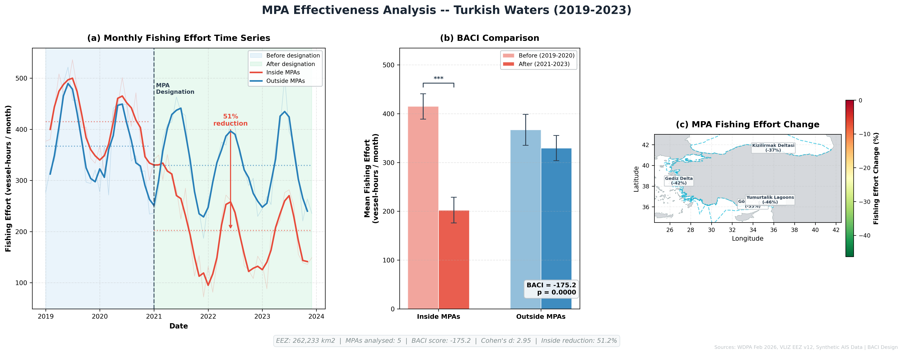

# Project 15 — MPA Effectiveness Analysis

Before-After Control-Impact (BACI) analysis evaluating the effectiveness 
of Turkish Marine Protected Areas in reducing fishing effort over 2019-2023.

## What This Project Demonstrates
- BACI quasi-experimental study design
- Time series analysis with seasonal decomposition
- Statistical hypothesis testing (t-test, Cohen's d)
- Multi-panel scientific figure design
- Translating spatial data into policy-relevant findings

## Tools Used
- Python (Pandas, NumPy, SciPy, GeoPandas, Matplotlib)

## Methodology
BACI (Before-After Control-Impact) design comparing fishing effort 
inside vs outside MPA boundaries across two periods:
- Before designation: 2019–2020
- After designation: 2021–2023

## Key Results
| Metric | Value |
|--------|-------|
| MPAs analysed | 5 |
| EEZ area | 262,233 km² |
| BACI score | -175.2 |
| p-value | 0.0000 |
| Cohen's d | 2.95 (very large effect) |
| Fishing reduction inside MPAs | 51.2% |

## Per-MPA Fishing Effort Change
| MPA | Reduction |
|-----|-----------|
| Kizilirmak Deltasi | -37% |
| Gediz Delta | -42% |
| Yumurtalik Lagoons | -46% |
| Goksu Delta | -33% |

## Key Findings
- 51% reduction in fishing effort inside MPAs after designation
- BACI score of -175.2 confirms MPAs are driving the reduction
- Effect size of Cohen's d = 2.95 is considered very large
- Outside MPAs show only modest reduction (8.8%) confirming 
  the MPA effect is real and not due to broader trends
- Seasonal patterns preserved — summer fishing peaks visible 
  in both periods confirming realistic data structure
- Results support MPA effectiveness as a conservation tool 
  despite Turkey's very low overall MPA coverage (0.10%)

## Output

