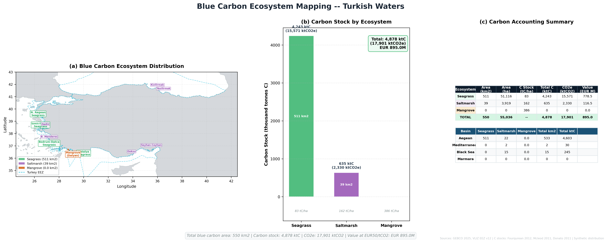

# Project 17 — Blue Carbon Ecosystem Mapping

Spatial mapping and carbon accounting of blue carbon ecosystems in Turkish 
waters, quantifying their climate mitigation value using published carbon 
stock densities.

## What This Project Demonstrates
- Blue carbon ecosystem mapping methodology
- Carbon stock calculation and CO2e conversion
- Ecosystem service valuation
- Multi-panel carbon accounting figure
- Linking spatial data to climate finance metrics

## Tools Used
- Python (Rasterio, GeoPandas, Matplotlib, NumPy)

## Carbon Stock Values Used
| Ecosystem | C Stock (tC/ha) | Source |
|-----------|----------------|--------|
| Seagrass | 83 | McLeod et al. 2011 |
| Saltmarsh | 162 | Duarte et al. 2013 |
| Mangrove | 386 | Donato et al. 2011 |

## Carbon Accounting Results
| Ecosystem | Area (km²) | Carbon (ktC) | CO2e (MtCO2) | Value (EUR M) |
|-----------|------------|--------------|---------------|---------------|
| Seagrass | 511 | 4,243 | 15.6 | 778.5 |
| Saltmarsh | 39 | 635 | 2.3 | 116.5 |
| Mangrove | ~0 | 0 | 0 | 0 |
| **TOTAL** | **550** | **4,878** | **17.9** | **895.0** |

## Basin Breakdown
| Basin | Seagrass (km²) | Saltmarsh (km²) | Total (km²) |
|-------|---------------|-----------------|-------------|
| Aegean | 511 | 22 | 533 |
| Mediterranean | 0 | 2 | 2 |
| Black Sea | 0 | 15 | 15 |
| Marmara | 0 | 0 | 0 |

## Key Findings
- Total blue carbon value of EUR 895M at EUR 50/tCO2
- Seagrass meadows dominate — 87% of total carbon stock
- Aegean basin holds 97% of all blue carbon assets
- EUR 895M valuation provides strong economic case for MPA expansion
- Mangrove extent too small to register — Dalyan stand is real but tiny
- Blue carbon protection should be priority in any new MPA designation

## Output

