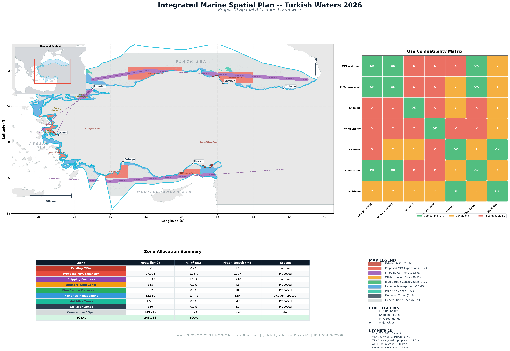

# Project 19 — Integrated Marine Spatial Plan

Capstone project synthesizing all findings from Projects 1-18 into a 
complete proposed spatial allocation framework for Turkish waters.

## What This Project Demonstrates
- Full MSP scenario development methodology
- Multi-use zone compatibility analysis
- Integrated spatial planning across competing sectors
- Policy-ready deliverable format
- Synthesis of 18 prior analyses into one coherent plan

## Tools Used
- Python (GeoPandas, Matplotlib, Rasterio, NumPy)

## Data Sources
- GEBCO 2025 Bathymetry
- WDPA Marine Protected Areas (Feb 2026)
- Marine Regions World EEZ v12
- Natural Earth 10m Land
- Synthetic layers from Projects 2-18

## Zone Allocation
| Zone | Area (km²) | % EEZ | Status |
|------|------------|-------|--------|
| Existing MPAs | 571 | 0.2% | Active |
| Proposed MPA Expansion | 27,995 | 11.5% | Proposed |
| Shipping Corridors | 31,147 | 12.8% | Active |
| Offshore Wind Zones | 188 | 0.1% | Proposed |
| Blue Carbon Conservation | 352 | 0.1% | Proposed |
| Fisheries Management | 32,580 | 13.4% | Active/Proposed |
| Multi-Use Zones | 1,550 | 0.6% | Proposed |
| Exclusion Zones | 186 | 0.1% | Proposed |
| General Use / Open | 149,215 | 61.2% | Default |
| **TOTAL** | **243,783** | **100%** | |

## Use Compatibility Matrix
| | MPA | Shipping | Wind | Fisheries | Blue Carbon |
|-|-----|----------|------|-----------|-------------|
| MPA | ✅ | ❌ | ❌ | ❌ | ✅ |
| Shipping | ❌ | ✅ | ❌ | ⚠️ | ❌ |
| Wind | ❌ | ❌ | ✅ | ⚠️ | ⚠️ |
| Fisheries | ❌ | ⚠️ | ⚠️ | ✅ | ⚠️ |
| Blue Carbon | ✅ | ❌ | ⚠️ | ⚠️ | ✅ |

## Key Metrics
- Total EEZ: 243,783 km²
- MPA coverage with proposed: 11.7%
- Protected + Managed: 38.8% of EEZ
- Wind energy zone: 188 km²
- Exclusion zones: 186 km² of high conflict areas
- 8 new MPA designations proposed

## Key Findings
- Proposed MPA expansion brings Turkey to 11.7% coverage
- 38.8% of EEZ under active spatial management
- 186 km² of exclusion zones where shipping overlaps wind/blue carbon
- Fisheries management covers entire continental shelf (32,580 km²)
- Plan provides realistic pathway toward CBD 30x30 by 2030

## Output

