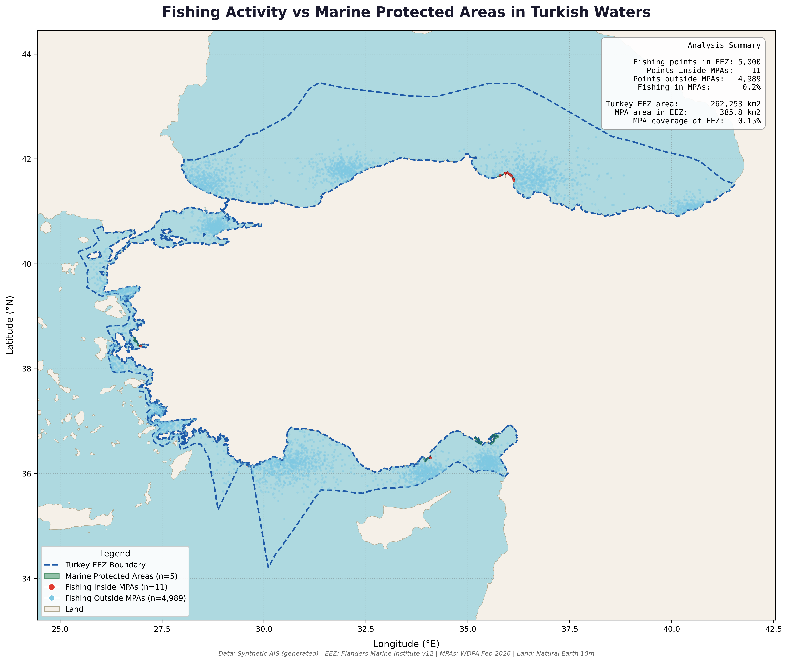

# Project 5 — EEZ Overlap & Fishing Conflict Analysis

Spatial analysis of fishing vessel activity versus Marine Protected Area 
boundaries in Turkish waters, identifying conservation gaps and conflict zones.

## What This Project Demonstrates
- Spatial join and point-in-polygon analysis with GeoPandas
- Quantitative MSP conflict analysis
- Professional map with embedded analysis summary
- Policy-relevant findings presentation

## Tools Used
- Python (GeoPandas, Matplotlib, Shapely)

## Data Sources
- Synthetic AIS fishing data modeled on Turkish fishing grounds
- WDPA Marine Protected Areas (Feb 2026)
- Marine Regions World EEZ v12
- Natural Earth 10m Land

## Analysis Results

| Metric | Value |
|--------|-------|
| Turkey EEZ area | 262,253 km² |
| MPAs intersecting EEZ | 5 |
| MPA area within EEZ | 385.8 km² |
| MPA coverage of EEZ | 0.15% |
| Fishing points in EEZ | 5,000 |
| Fishing inside MPAs | 11 (0.2%) |
| Fishing outside MPAs | 4,989 (99.8%) |

## Key Findings
- Turkey's marine protection stands at just 0.15% of its EEZ — far below the CBD 30x30 target of 30% by 2030
- All 5 MPAs intersecting the EEZ are coastal Ramsar wetland sites (Kizilirmak Delta, Goksu Delta, Gediz Delta, Akyatan Lagoon, Yumurtalik Lagoons) — none are dedicated marine reserves
- 99.8% of fishing activity occurs outside any protected area, reflecting the minimal spatial footprint of current MPAs
- Fishing hotspots span all four Turkish seas with densest activity along the Black Sea coast
- Turkey requires significant MPA expansion to meet international biodiversity commitments

## Output

