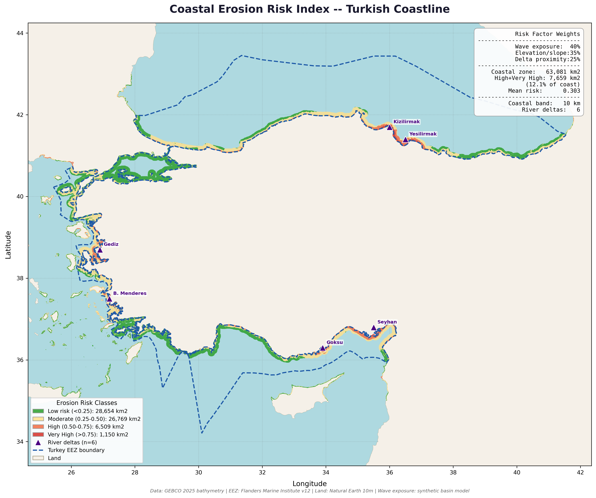

# Project 8 — Coastal Erosion Risk Index

Multi-factor coastal erosion risk assessment for the Turkish coastline 
combining wave exposure, elevation vulnerability, and river delta proximity.

## What This Project Demonstrates
- Multi-criteria risk index development
- Synthetic environmental variable modelling
- Coastal geomorphology analysis
- Risk classification and cartographic visualization

## Tools Used
- Python (Rasterio, NumPy, GeoPandas, Matplotlib)

## Data Sources
- GEBCO 2025 Bathymetry
- Marine Regions World EEZ v12
- Natural Earth 10m Land
- Wave exposure: synthetic basin model

## Risk Factor Weights
| Factor | Weight | Rationale |
|--------|--------|-----------|
| Wave exposure | 40% | Primary erosion driver |
| Elevation/slope | 35% | Coastal vulnerability |
| Delta proximity | 25% | Sediment dynamics |

## Analysis Results
| Risk Class | Area (km²) | % of Coast |
|------------|------------|------------|
| Low (<0.25) | 28,654 | 45.4% |
| Moderate (0.25–0.50) | 26,769 | 42.4% |
| High (0.50–0.75) | 6,509 | 10.3% |
| Very High (>0.75) | 1,150 | 1.8% |
| High + Very High | 7,659 | 12.1% |
| Total coastal zone | 63,081 | 100% |
| Mean risk score | 0.303 | |

## River Delta Hotspots
| Delta | Mean Risk | Max Risk |
|-------|-----------|----------|
| Kizilirmak | 0.913 | 1.000 |
| B. Menderes | 0.749 | 0.870 |
| Goksu | 0.682 | 0.861 |
| Yesilirmak | 0.536 | 0.599 |
| Gediz | 0.528 | 0.758 |

## Key Findings

**Black Sea:** Continuous orange/yellow risk band along the entire coast due 
to high wave exposure, with red hotspots at Kizilirmak and Yesilirmak deltas. 
Kizilirmak reaches maximum risk score of 1.0.

**Aegean:** Patchy risk pattern reflecting island sheltering effects. Buyuk 
Menderes and Gediz deltas show localized high risk zones against a generally 
moderate background.

**Mediterranean:** Goksu delta and Iskenderun Bay (Seyhan) are clear hotspots 
against a generally moderate-risk coast.

**Sea of Marmara:** Mostly low risk due to enclosed basin geometry significantly 
dampening wave energy — the only Turkish sea basin with predominantly green 
(low risk) classification.

Overall, 12.1% of Turkish coastline requires priority attention for coastal 
protection investment, concentrated at river delta systems.

## Output

