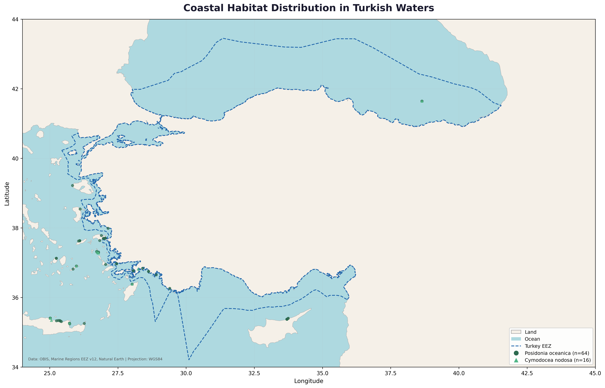

# Coastal Habitat Distribution in Turkish Waters

Mapping the spatial distribution of key seagrass species (*Posidonia oceanica* and *Cymodocea nodosa*) in Turkish marine waters as part of a Marine Spatial Planning (MSP) portfolio.



## Overview

This script fetches species occurrence data from the [Ocean Biodiversity Information System (OBIS)](https://obis.org/) API and overlays it on Turkey's Exclusive Economic Zone (EEZ) to visualize coastal habitat distribution across the Aegean, Mediterranean, and Black Sea.

## Data Sources

| Dataset | Source | Link |
|---|---|---|
| Species occurrences | OBIS API v3 | https://obis.org |
| Exclusive Economic Zone | Marine Regions EEZ v12 | https://marineregions.org/downloads.php |
| Land boundaries | Natural Earth 10m | https://naturalearthdata.com/downloads/ |

## Species

- **Posidonia oceanica** -- Endemic Mediterranean seagrass, key indicator of coastal ecosystem health
- **Cymodocea nodosa** -- Widely distributed seagrass found in the Mediterranean and eastern Atlantic

## Requirements

- Python 3.8+
- `requests`, `pandas`, `geopandas`, `matplotlib`, `shapely`

Missing packages are installed automatically when the script runs.

## Shapefiles Setup

Download and extract the following into a `downloads/` directory:

1. **EEZ**: [World_EEZ_v12](https://marineregions.org/downloads.php) -- filter to `SOVEREIGN1 = 'Turkey'`
2. **Land**: [Natural Earth 10m Land](https://naturalearthdata.com/downloads/10m-physical-vectors/)

Update the file paths in `coastal_habitat.py` to match your local directory structure.

## Usage

```bash
python coastal_habitat.py
```

The script will:
1. Fetch occurrence records from OBIS (bounding box: 25-42E, 35-43N)
2. Load EEZ and land shapefiles
3. Generate a 300 DPI map saved as `turkey_coastal_habitat_map.png`

## Output

The map displays:
- Light blue ocean with beige land masses
- Turkey's EEZ boundary (dashed blue line)
- *Posidonia oceanica* occurrences (green circles)
- *Cymodocea nodosa* occurrences (teal triangles)

## Author

Ahsan Hussain Khan

