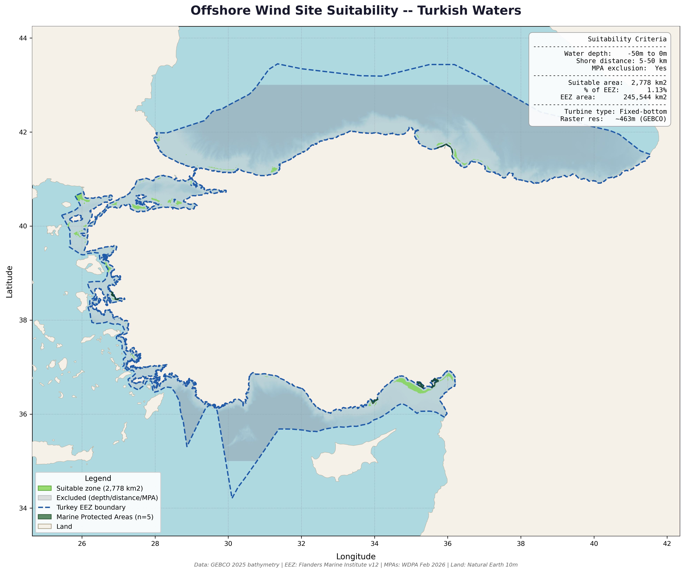

# Project 6 — Offshore Wind Site Suitability Screening

Multi-criteria spatial analysis to identify suitable locations for fixed-bottom 
offshore wind turbines in Turkish waters using GEBCO bathymetry and exclusion 
zone analysis.

## What This Project Demonstrates
- Raster-based multi-criteria suitability analysis
- Distance buffering and spatial filtering with Rasterio and GeoPandas
- Combining raster and vector datasets for planning analysis
- Quantitative energy potential estimation
- Professional cartographic output with analysis summary

## Tools Used
- Python (Rasterio, GeoPandas, Matplotlib, NumPy, SciPy)

## Data Sources
- GEBCO 2025 Bathymetry (463m resolution)
- Marine Regions World EEZ v12
- WDPA Marine Protected Areas (Feb 2026)
- Natural Earth 10m Land

## Suitability Criteria
| Criterion | Value | Rationale |
|-----------|-------|-----------|
| Water depth | 0 to -50m | Fixed-bottom turbine operational range |
| Distance from shore | 5–50km | Visual impact and navigation safety |
| MPA exclusion | Yes | Environmental protection |

## Analysis Results
| Metric | Value |
|--------|-------|
| Suitable area | 2,778 km² |
| % of EEZ | 1.13% |
| EEZ total area | 245,544 km² |
| Excluded — too deep | 227,302 km² |
| Excluded — too close to shore | 13,185 km² |
| Excluded — in MPA | 0 km² |
| Theoretical capacity | 41.7 GW |

## Key Findings
- Suitable zones concentrated along the shallow Aegean coast and a strip 
  along the eastern Mediterranean
- Black Sea largely excluded due to depths exceeding 50m beyond the near-shore buffer
- Zero suitable area excluded by MPAs — directly reflecting Turkey's minimal 
  MPA footprint (0.15% EEZ coverage from Project 5)
- 41.7 GW theoretical capacity represents significant renewable energy potential 
  for Turkey's clean energy transition
- Results align with Turkey's current offshore wind policy focus on the Aegean

## Output

