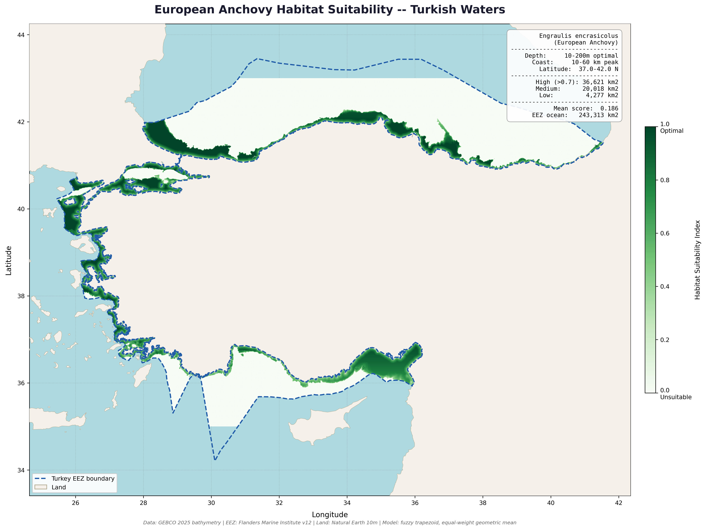

# Project 7 — Habitat Suitability Modelling

Species distribution model for European Anchovy (Engraulis encrasicolus) 
in Turkish waters using bathymetric and environmental variables.

## What This Project Demonstrates
- Species Distribution Modelling (SDM) using environmental variables
- Fuzzy trapezoid membership functions for suitability scoring
- Raster-based multi-criteria analysis with Rasterio and NumPy
- Combining depth, distance, and latitude variables into a composite index
- Publication-quality scientific map output

## Tools Used
- Python (Rasterio, NumPy, GeoPandas, Matplotlib)

## Data Sources
- GEBCO 2025 Bathymetry (463m resolution)
- Marine Regions World EEZ v12
- Natural Earth 10m Land

## Model Parameters
| Variable | Optimal Range | Rationale |
|----------|--------------|-----------|
| Water depth | 10–200m | Anchovy prefer continental shelf waters |
| Distance from coast | 10–60km peak | Coastal affinity of the species |
| Latitude | 37–42°N | Turkish waters thermal preference |
| Method | Fuzzy trapezoid, equal-weight geometric mean | |

## Analysis Results
| Suitability Class | Area (km²) |
|-------------------|------------|
| High (>0.7) | 36,621 |
| Medium (0.4–0.7) | 20,018 |
| Low (<0.4) | 4,277 |
| Mean suitability score | 0.186 |
| Total EEZ ocean area | 243,313 km² |

## Key Findings
- High suitability zones follow the Turkish continental shelf closely 
  across all three sea basins
- Black Sea coastal shelf shows the strongest continuous high-suitability band
- Aegean coast fragmented by islands but shows strong localized suitability
- Eastern Mediterranean coast near Iskenderun Bay shows notable high suitability
- Results are consistent with published anchovy distribution data for the region

## Output

