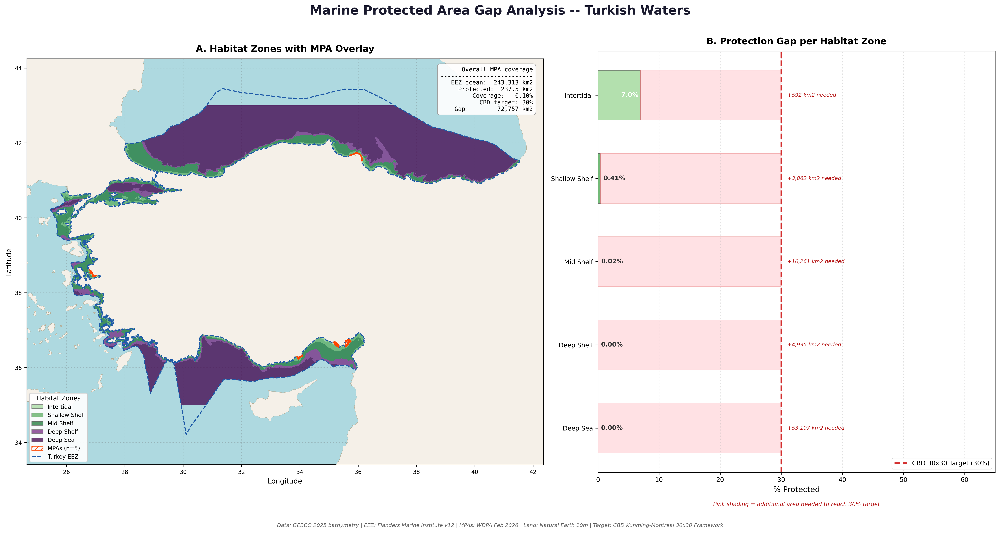

# Project 9 — MPA Gap Analysis

Systematic gap analysis of Marine Protected Area coverage across habitat 
zones in Turkish waters against the CBD Kunming-Montreal 30x30 Framework.

## What This Project Demonstrates
- Spatial gap analysis methodology
- Multi-habitat zone classification from bathymetric data
- Policy-relevant quantitative analysis (CBD 30x30 framework)
- Dual-panel figure combining map and chart outputs

## Tools Used
- Python (Rasterio, GeoPandas, Matplotlib, NumPy)

## Data Sources
- GEBCO 2025 Bathymetry
- WDPA Marine Protected Areas (Feb 2026)
- Marine Regions World EEZ v12
- Natural Earth 10m Land
- Target: CBD Kunming-Montreal 30x30 Framework

## Gap Analysis Results
| Habitat Zone | Total Area | In MPA | % Protected | Additional Needed |
|-------------|------------|--------|-------------|-------------------|
| Intertidal (0 to -10m) | 2,568 km² | 178.7 km² | 6.96% | 592 km² |
| Shallow Shelf (-10 to -50m) | 13,052 km² | 53.5 km² | 0.41% | 3,862 km² |
| Mid Shelf (-50 to -200m) | 34,221 km² | 5.3 km² | 0.02% | 10,261 km² |
| Deep Shelf (-200 to -500m) | 16,449 km² | 0.0 km² | 0.00% | 4,935 km² |
| Deep Sea (< -500m) | 177,023 km² | 0.0 km² | 0.00% | 53,107 km² |
| **TOTAL** | **243,313 km²** | **237.5 km²** | **0.10%** | **72,757 km²** |

## Key Findings
- Turkey protects just 0.10% of its EEZ — 300x below the CBD 30x30 target
- Intertidal zone has the highest coverage at 6.96%, entirely from 5 Ramsar wetland sites
- Deep shelf and deep sea have zero protection — the largest absolute gap
- Deep sea alone requires 53,107 km² of new MPAs to reach 30%
- Total of 72,757 km² of new MPAs needed across all habitat types
- All current MPAs are coastal wetland sites — no dedicated offshore marine reserves exist

## Output

