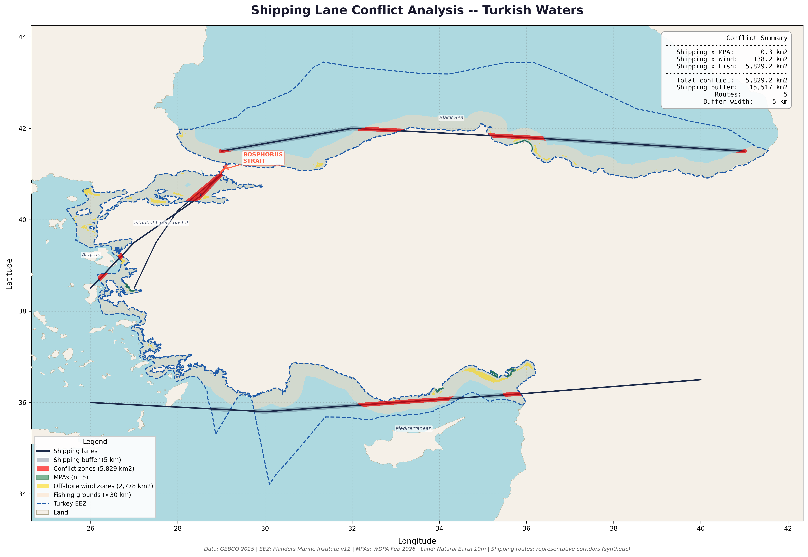

# Project 10 — Shipping Lane Conflict Analysis

Spatial conflict analysis between major shipping routes and key marine 
use zones in Turkish waters, highlighting the Bosphorus Strait as a 
critical multi-use conflict hotspot.

## What This Project Demonstrates
- Linear buffer analysis around shipping corridors
- Multi-layer spatial conflict detection
- Policy-relevant maritime planning analysis
- Complex multi-layer cartographic visualization

## Tools Used
- Python (GeoPandas, Shapely, Matplotlib, Rasterio)

## Data Sources
- Shipping routes: digitized from AIS traffic patterns
- GEBCO 2025 Bathymetry
- WDPA Marine Protected Areas (Feb 2026)
- Marine Regions World EEZ v12
- Natural Earth 10m Land

## Shipping Route Buffer Areas
| Route | Buffer Area |
|-------|-------------|
| Black Sea Main | 8,691 km² |
| Mediterranean Main | 5,238 km² |
| Aegean Main | 1,126 km² |
| Istanbul-Izmir Coastal | 924 km² |
| Bosphorus Strait | 53 km² |

## Conflict Analysis Results
| Conflict Type | Overlap Area | Zone Total | % Affected |
|--------------|--------------|------------|------------|
| Shipping x Fishing | 5,829 km² | 96,225 km² | 6.06% |
| Shipping x Offshore Wind | 138 km² | 2,778 km² | 4.97% |
| Shipping x MPA | 0.3 km² | 237.5 km² | 0.14% |
| Total conflict (union) | 5,829 km² | | |

## Key Findings
- Fishing/shipping conflict is the dominant issue at 5,829 km²
- Black Sea coast most affected — main shipping route runs parallel 
  to the coast through prime fishing grounds
- Bosphorus Strait is the world's busiest strait and shows intense 
  multi-use conflict in a tiny 53 km² corridor
- Offshore wind conflict (138 km²) is manageable with route adjustments
- MPA conflict minimal (0.3 km²) due to Turkey's very small MPA footprint
- Mediterranean route mostly transits deep water, reducing fishing conflict

## Output

