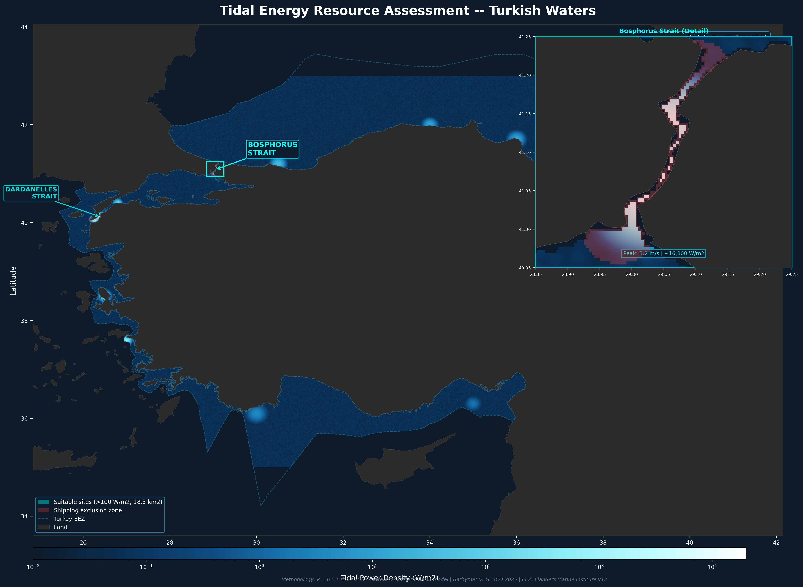

# Project 12 — Tidal Energy Resource Assessment

Tidal current energy resource mapping for Turkish waters using the 
P = 0.5 × ρ × v³ power density formula, with shipping exclusion 
and depth constraints applied.

## What This Project Demonstrates
- Tidal energy resource calculation from current velocity data
- Multi-constraint suitability filtering
- Log-scale raster visualization
- Inset map design for detail areas
- Realistic engineering constraint application

## Tools Used
- Python (NumPy, Rasterio, GeoPandas, Matplotlib)

## Methodology
Power density calculated using: P = 0.5 × ρ × v³
- ρ = 1025 kg/m³ (seawater density)
- v = tidal current velocity (m/s)
- Depth constraint: <40m
- Shipping exclusion: 5km buffer
- MPA exclusion applied

## Key Results
| Metric | Value |
|--------|-------|
| Suitable area (≥100 W/m²) | 18.3 km² |
| Marginal area (10–100 W/m²) | 154.3 km² |
| Mean power density (suitable) | 137 W/m² |
| Technical potential | 750 MW (0.8 GW) |

## Site Analysis
| Site | Peak Velocity | Peak Power | Suitable Area | Potential |
|------|--------------|------------|---------------|-----------|
| Bosphorus | 2.98 m/s | 13,570 W/m² | 0 km²* | 0 MW* |
| Dardanelles | 2.16 m/s | 5,191 W/m² | 3.5 km² | 199 MW |

*Bosphorus excluded entirely — 40,000+ vessels/year make tidal 
installations unfeasible despite world-class energy resource.

## Key Findings
- Bosphorus has the highest tidal power density in Turkish waters 
  (13,570 W/m²) but is fully excluded by shipping constraints
- Dardanelles is the primary exploitable site at 199 MW potential
- Aegean island channels show minor tidal resource between islands
- Black Sea and Mediterranean have negligible tidal resource
- Total technical potential of 750 MW is modest — Turkey's tidal 
  energy future lies in offshore wind (41.7 GW from Project 6)
- Log-scale colorbar spans 4 orders of magnitude reflecting extreme 
  variation between strait and open water environments

## Output

